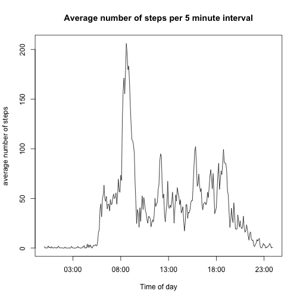
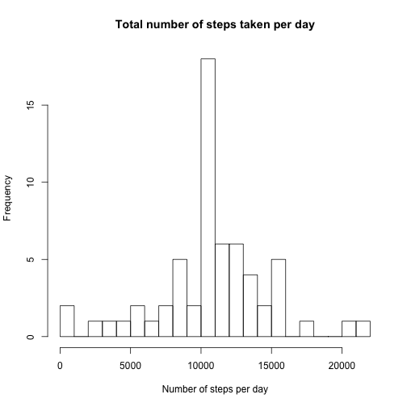
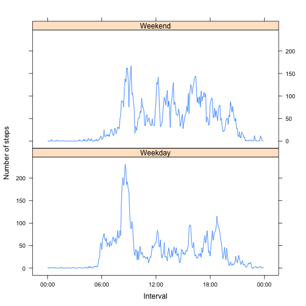

<!-- rmarkdown v1 -->
Acticity monitoring data
========================
**author: mark Tiele Westra**  
**date: 5 may 2016**

Note to the reviewer: I have specifically chosen to use the real time as a x-axis of the various plots, instead of the interval number. I feel that this gives a more natural representation of the data.

### 1. Code for reading in the dataset and/or processing the data
Read in the data:

```r
unzip("./activity.zip")
activity <- read.csv("./activity.csv", sep = ",", header = TRUE,na.strings="NA")
```

### 2. Histogram of the total number of steps taken each day
Aggregate the steps data by the day, to compute the total number of steps per day:

```r
stepsPerDay <-aggregate(activity$steps, by=list(activity$date), FUN=sum, na.rm=TRUE)
```

A histogram of the total number of steps per day:

```r
hist(stepsPerDay$x,breaks=20,xlab="Number of steps per day",main="Total number of steps taken per day")
```


### 3. Mean and median number of steps taken each day
Compute the mean and the median of the total number of steps per day.

```r
mean <- mean(stepsPerDay$x,na.rm=TRUE)
median <- median(stepsPerDay$x,na.rm=TRUE)
```
The **mean** is 9354.2, the **median** is 10395.0.

### 4. Time series plot of the average number of steps taken
From the span of values in the interval column, we note that the last two digits of the identifier corresponds to the number of minutes, while the digits to the left of the last two correspond with the hour. As we want to show a decent time plot, we need to parse these to a time of day. After that, we aggregate by time, and compute the mean for each 5 minute interval.


```r
hours <- trunc(activity$interval / 100)
minutes <- activity$interval - hours*100
activity$timeString <- paste(hours,sprintf("%02d", minutes),sep=":")

# aggregate by time
stepsPerInterval <-aggregate(x=activity$steps, by=list(time=activity$timeString), FUN=mean, na.rm=TRUE)

# create time column which we will use for our time series plot, and sort by time
stepsPerInterval$timeOfDay <- as.POSIXlt(stepsPerInterval$time,format="%H:%M")
stepsPerInterval <- stepsPerInterval[order(stepsPerInterval$timeOfDay),]

# plot the average number of steps as a function of time
plot(stepsPerInterval$timeOfDay,stepsPerInterval$x,type="l",xlab="Time of day",ylab="average number of steps",main="Average number of steps per 5 minute interval")
```



### 5. The 5-minute interval that, on average, contains the maximum number of steps
To compute the 5 minute interval that contains the maximum number of steps, we first aggregate the original data using the interval identifier.


```r
# aggregate the steps by interval
stepsPerInterval <-aggregate(x=activity$steps, by=list(time=activity$interval), FUN=mean, na.rm=TRUE)
maxIndex <- which.max(stepsPerInterval[,"x"])
maxInterval <- stepsPerInterval[maxIndex,"time"]
```
The interval that has on average the largest number of steps has id: 835.


### 6. Code to describe and show a strategy for imputing missing data
First, we compute the number of rows with missing values
From the summary of the dataset, we see that only the steps column has any missing values:

```r
summary(activity)
```

```
##      steps                date          interval       timeString       
##  Min.   :  0.00   2012-10-01:  288   Min.   :   0.0   Length:17568      
##  1st Qu.:  0.00   2012-10-02:  288   1st Qu.: 588.8   Class :character  
##  Median :  0.00   2012-10-03:  288   Median :1177.5   Mode  :character  
##  Mean   : 37.38   2012-10-04:  288   Mean   :1177.5                     
##  3rd Qu.: 12.00   2012-10-05:  288   3rd Qu.:1766.2                     
##  Max.   :806.00   2012-10-06:  288   Max.   :2355.0                     
##  NA's   :2304     (Other)   :15840
```

```r
stepsNAnum <- sum(is.na(activity$steps)) 
```
In total, there are 2304 rows with NA value in this dataset.

To impute these NA values, we'll use the mean value for that 5 minute interval. 

```r
# start with the original data set
activity <- read.csv("./activity.csv", sep = ",", header = TRUE,na.strings="NA")

# compute the mean number of steps for each interval
stepsPerIntervalMean <-aggregate(x=activity$steps, by=list(interval=activity$interval), FUN=mean, na.rm=TRUE)

# add new column to activity with the mean number for each interval, using merge
activity <- merge(activity, stepsPerIntervalMean, by="interval")

# find NA rows
NArows <- is.na(activity$steps)

# replace NA values with the mean for that interval
activity$steps[NArows] <- activity$x[NArows]

# remove the temporary column with average values
activity <- activity[,!names(activity) == "x"]
```

### 7. Histogram of the total number of steps taken each day after missing values are imputed
Now that we have a new dataset with the NA values imputed, let's look at the histogram and mean and median values again.


```r
stepsPerDay <-aggregate(activity$steps, by=list(activity$date), FUN=sum, na.rm=TRUE)
```

A histogram of the total number of steps per day:

```r
hist(stepsPerDay$x,breaks=20,xlab="Number of steps per day",main="Total number of steps taken per day")
```



Compute the mean and the median of the total number of steps per day.

```r
mean <- mean(stepsPerDay$x,na.rm=TRUE)
median <- median(stepsPerDay$x,na.rm=TRUE)
```
The **mean** is 10766.2, the **median** is 10766.2.

What we see is that the number of days on which very little steps were taken has been reduced to only a few, and that the number of 'avarage' days has increased, which is to be expected - we replaced the NA values with averages, in effect creating 'average days'. This is also reflected in the mean and median: where the median has not changed very much, the mean has shifted to the right. 

In short, imputing the data has led to a small increase in the median values for the total number of steps, which is to expected because the number of NA values is small in comparison to the total number of observations. The mean is effected more, because of the large impact of an observation of zero on the average.

### 8. Panel plot comparing the average number of steps taken per 5-minute interval across weekdays and weekends

```r
# add weekday column (0..6, 0 = sunday)
activity$weekdayNum <- as.POSIXlt(activity$date,format="%Y-%m-%d")$wday
weekendRows <- activity$weekdayNum == 6 | activity$weekdayNum == 0
activity$weekday[weekendRows] <- "Weekend"
activity$weekday[!weekendRows] <- "Weekday"

# aggregate by interval and weekend
stepsPerIntervalMean <-aggregate(x=activity$steps, by=list(interval=activity$interval,weekday=activity$weekday), FUN=mean)

# now, create the time column again
hours <- trunc(stepsPerIntervalMean$interval / 100)
minutes <- stepsPerIntervalMean$interval - hours*100
stepsPerIntervalMean$timeString <- paste(hours,sprintf("%02d", minutes),sep=":")
stepsPerIntervalMean$timeOfDay <- as.POSIXct(stepsPerIntervalMean$timeString,format="%H:%M")

# sort by weekend and then by time of day
stepsPerIntervalMean <- stepsPerIntervalMean[order(stepsPerIntervalMean$weekday, stepsPerIntervalMean$timeOfDay),]

# create the panel plot
library(lattice)
xyplot(x ~ timeOfDay| factor(weekday), 
           data = stepsPerIntervalMean,
           type = "l",
           scales = list(x = list(format = "%H:%M")),
           xlab = "Interval",
           ylab = "Number of steps",
           layout=c(1,2))
```



From these plots, we can see that in the weekend, the subject rises about two hours later than on weekdays, and that in the weekend the steps are more spread out over the day.
